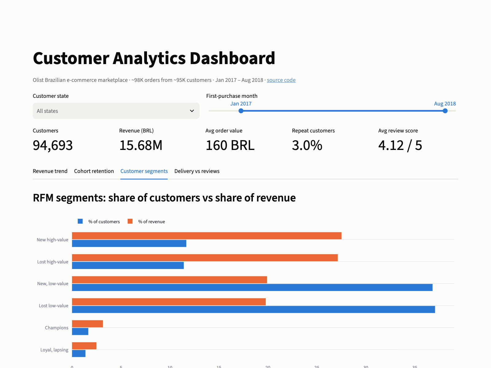
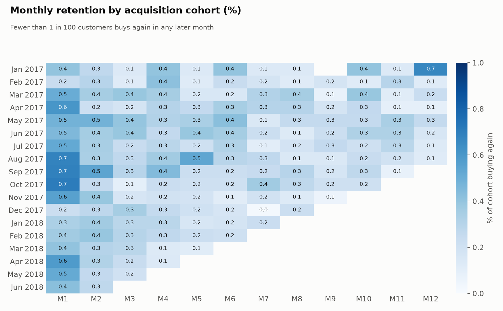
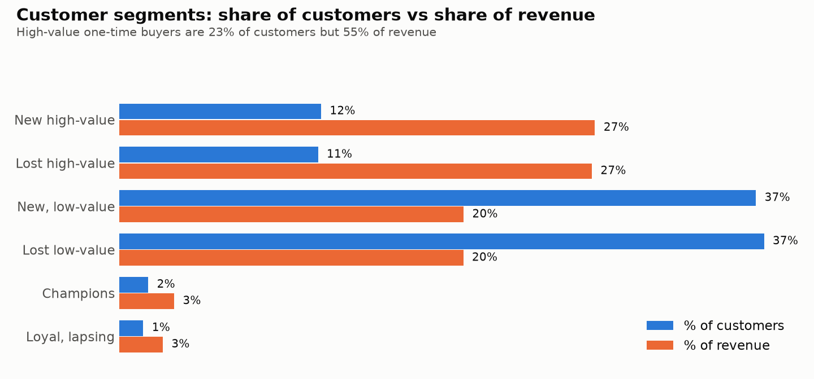
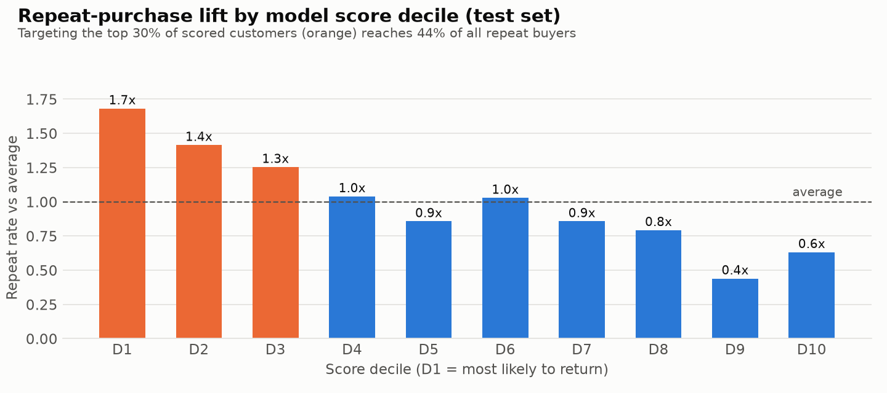

# Customer Analytics: LTV, Retention & Repeat-Purchase Prediction

[](https://github.com/VineethVadlapalli/olist-customer-analytics/actions/workflows/ci.yml)    

**[▶ Live dashboard: olist-customer-analyticz.streamlit.app](https://olist-customer-analyticz.streamlit.app/)**

**How much is a customer worth, do they come back, and who should a retention budget target?** An end-to-end customer analytics project on ~98K real orders from ~95K customers of a Brazilian e-commerce marketplace. It covers cohort retention, lifetime value, RFM segmentation, a repeat-purchase prediction model and an interactive dashboard.



---

## Key findings

| # | Finding | So what |
|---|---|---|
| 1 | **Only 3.0% of customers ever buy twice**, and they bring in just 5.7% of revenue | This is a one-purchase business: growth depends on acquisition, so CAC has to be paid back by the **first** order |
| 2 | **12-month LTV is only 2.8% above the first basket** (168 → 173 BRL) | Don't model payback on repeat purchases that don't happen |
| 3 | **High-value one-time buyers are 23% of customers but 55% of revenue** | Target "New high-value" customers with win-back offers before they lapse |
| 4 | **A repeat-purchase model gives 1.7x lift in the top decile**; the top 30% of scores contain 44% of repeat buyers | Focus retention spend where it's most likely to work: reach 44% of returners for 30% of the budget |
| 5 | **Simple logistic regression matches gradient boosting** (ROC-AUC 0.596 vs 0.599) | Ship the simpler, explainable model |

---

## What's inside

### 1. Cohorts, LTV and segments: [`notebooks/01_cohorts_ltv_segments.ipynb`](notebooks/01_cohorts_ltv_segments.ipynb)



- Monthly **acquisition cohorts** with month-by-month retention
- **LTV curve**: cumulative revenue per customer over 12 months
- **RFM segmentation** into 6 action-oriented segments, with each segment's share of customers vs revenue



### 2. Repeat-purchase prediction: [`notebooks/02_repeat_purchase_model.ipynb`](notebooks/02_repeat_purchase_model.ipynb)

Predicts, from first-order data, whether a customer buys again within 180 days.

- **Honest evaluation:** time-based train/test split (train before Oct 2017, test after) so the model never sees the future; a random split would overstate performance
- **Built for imbalance** (only ~3% positive): judged on PR-AUC and **lift by decile**, not accuracy. Predicting "nobody returns" is 97% accurate and useless
- Logistic regression baseline vs `HistGradientBoostingClassifier` with native categorical features
- **Permutation importance** to explain what drives the score (product category first)



### 3. Interactive dashboard: [live demo](https://olist-customer-analyticz.streamlit.app/) · [`app/streamlit_app.py`](app/streamlit_app.py)

KPI tiles, revenue trend, cohort heatmap, RFM segments and delivery vs reviews, all filterable by customer state and first-purchase month, with hover tooltips on every chart. Smoke-tested with Streamlit's `AppTest` in CI.

---

## Data preparation

All modelling tables are built with SQL in **DuckDB** straight from the raw CSVs ([`src/features.py`](src/features.py)):

- **Real customers, not order IDs:** the source gives a new `customer_id` on every order, so everything is keyed on `customer_unique_id`
- **Duplicate reviews** (547 orders have several) are reduced to the latest one per order
- **Cancelled / unavailable orders** are excluded from revenue
- **Partial months** at the edges of the data are excluded from trends
- **Label with a complete observation window:** only first orders with a full 180 days of follow-up are labelled, so recent customers aren't wrongly counted as "never returned"

---

## Run it yourself

Requires [uv](https://docs.astral.sh/uv/) (installs Python 3.12 automatically).

```bash
git clone https://github.com/VineethVadlapalli/olist-customer-analytics.git
cd olist-customer-analytics
make setup       # create the environment
make features    # download raw data + build DuckDB tables (~30 s)
make notebooks   # re-run both notebooks
make app         # dashboard at http://localhost:8501
make test        # dashboard smoke tests
```

## Project structure

```
├── src/
│   ├── features.py           # DuckDB SQL: orders, customers (RFM), cohorts, model table
│   ├── export_app_data.py    # compact parquet files for the dashboard
│   └── plotting.py           # shared chart style
├── notebooks/                # .py source (jupytext) + executed .ipynb with outputs
├── app/streamlit_app.py      # interactive dashboard
├── tests/test_app.py         # dashboard smoke tests
├── scripts/download_data.py  # raw data download
└── .github/workflows/ci.yml  # rebuild features, re-run notebooks, test the app
```

---

**Related project:** [Modern Data Stack in a Box](https://github.com/VineethVadlapalli/olist-modern-data-stack), the same dataset modelled as a production pipeline with dbt, DuckDB and Dagster.

**Dataset:** [Olist Brazilian E-commerce](https://www.kaggle.com/datasets/olistbr/brazilian-ecommerce) (CC BY-NC-SA 4.0).

**Built by Vineeth Vadlapalli**, Data Engineer & Analyst. I turn raw data into decisions: pipelines, models and dashboards. [Hire me on Upwork](https://www.upwork.com/freelancers/~017ac26a139c1765cd)
